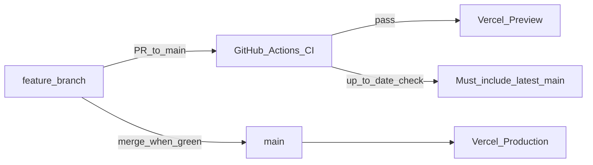

# CI/CD, Vercel, and branch safety

## Overview

| Layer | What it does |
| --- | --- |
| **GitHub Actions CI** | Lint + build on every PR to `main`; fails if the PR branch is behind `main` |
| **Vercel** | Preview deploys for PRs; production deploys from `main` |
| **App firewall** | Security headers + middleware blocking common probe paths |
| **Vercel Firewall** | Bot fight / attack challenge (enable in dashboard) |
| **Branch protection** | Require PR reviews, required CI checks, **require branch up to date with main** |



---

## 1. Connect Vercel (one-time)

1. Go to [vercel.com](https://vercel.com) → **Add New Project** → import `aifest-africa/aifestwebsite`.
2. Framework: **Next.js** (auto-detected). Root directory: repo root.
3. Add environment variables (Production + Preview), matching [`.env.example`](../.env.example):
   - Neon: `DATABASE_URL`, `DATABASE_URL_UNPOOLED`, `NEON_BRANCH`
   - Storage: `AWS_*`, `S3_BUCKET_NAME`, `NEXT_PUBLIC_MEDIA_BASE_URL`
4. Production branch: **`main`**.
5. Optional: enable **Deployment Protection** for previews (password / Vercel auth).

After linking, every PR gets a Preview URL; merges to `main` ship Production.

---

## 2. Vercel Firewall / bot protection (dashboard)

In the Vercel project → **Firewall** (or **Security**):

- Turn on **Attack Challenge Mode** / bot management for production.
- Optionally rate-limit `/` and form endpoints if abuse appears.
- Keep custom rules minimal until you see real traffic patterns.

App-level headers/middleware already reduce common scanner noise; Vercel Firewall is the edge WAF.

---

## 3. GitHub branch protection (requires org admin)

Current contributors with push-only access cannot set this via API. An **org owner / admin** should run:

```bash
# Requires: admin on aifest-africa/aifestwebsite
# After the first CI run on a PR, the check names will be:
#   "Lint & build" and "Up to date with main"

gh api -X PUT repos/aifest-africa/aifestwebsite/branches/main/protection \
  -H "Accept: application/vnd.github+json" \
  -f required_status_checks='{"strict":true,"contexts":["Lint & build","Up to date with main"]}' \
  -F enforce_admins=true \
  -F required_pull_request_reviews='{"required_approving_review_count":1,"dismiss_stale_reviews":true}' \
  -F restrictions= \
  -F allow_force_pushes=false \
  -F allow_deletions=false \
  -F required_linear_history=false \
  -F require_conversation_resolution=true
```

Or in GitHub UI: **Settings → Branches → Add rule** for `main`:

- [x] Require a pull request before merging  
- [x] Require status checks to pass → select **Lint & build** and **Up to date with main**  
- [x] **Require branches to be up to date before merging** (`strict: true`)  
- [x] Do not allow force pushes  

`strict: true` / “up to date before merging” is the GitHub-native guarantee that `main` content is always in the branch before merge. CI also fails early if the branch is behind.

---

## 4. Keep your branch updated (contributors)

Before opening or updating a PR:

```bash
git fetch origin
git merge origin/main
# or: git rebase origin/main
git push
```

If CI reports **“This branch is behind main”**, merge/rebase `main` and push again.

---

## 5. Security controls in this repo

| Control | Location |
| --- | --- |
| CSP + HSTS + frame / referrer / permissions | [`next.config.ts`](../next.config.ts) |
| Edge probe blocking + extra headers | [`src/middleware.ts`](../src/middleware.ts) |
| Platform headers | [`vercel.json`](../vercel.json) |
| Secrets not in git | `.gitignore` (`.env*`, `.neon`) |

---

## 6. Required secrets on Vercel (not GitHub Actions)

CI uses placeholder media URL for build only. **Production/Preview** must set real Neon values in the Vercel project env UI (or `vercel env pull` for local).
